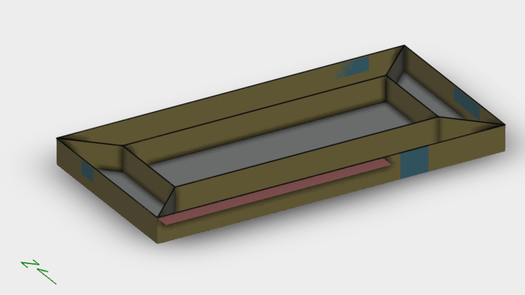

# AECO-ontologies / vocabularies
![semantic-web](data:image/png;base64,iVBORw0KGgoAAAANSUhEUgAAAVwAAACRCAMAAAC4yfDAAAAA51BMVEX///8AAAAoPpmfn5/29vbZ2dlwcHCtra3KyspNTU2KioolPJjx8fF+fn4TExP7+/sZGRkeN5YYM5UkJCQQL5QAKZKVlZUVMZSlpaX29/vw8vjCx98AJZEvRJwFKpLr6+vh5PC3t7dda65CVKPU2OnKzuOlrNBndLKYoMnQ0NBEREQxMTGutNQ+UaJVVVU9PT2FkMFSYal2gbnAwMBuerV7hryNlsS5vtpkZGSrsdPZ3eySm8YSHEVTYqhfba4AFk0PJG4kOY8HDioeLnJnaXG/wcsTIFMJDiMaKGMAAC4ADE2ZnbKGjbNJPBC1AAAPcklEQVR4nO2dC1vbOBaGTQqFVoWMVKUmTmxMnFtb0iYhlxIWdjuzO3v9/79nfYlt3S1fOqEZfc8zUyCRcF6OpaOjc2TLMtJRd/SwmQRuyw2elg8959CXc0TqblfIsxEEoNUCANqe9/xg+Dai7tTFMMRKCEAM1v6hL+wINIY2SIAiHMmODbgFkLc01ltPoxmOUULPXT32RsPhaLx+QhjGeNHdoS/vp9bUi63WttcjwkyduyD+Oeisuoe7tp9dy9hsEZzSDEPOPTcy3hYKzNBQUQMcmae3ztH6d0vX6/f73mA6iG0atvzDXd/PrGc7ogd66ffduycP76czgGZBQtc1tltBq5ht4O+/bUceGeWPJf/AwIy7pTX1YnLt/bfbvUfGC00Oep0/o4b9iO0su+fHWIw2VGcr7eXUSKB3QbzU9XNOM4nhRk6wL+zDss5PjAT6a4TS6xFGOEVS0wV/E/ZxbuCK9T0aTNfkHb6Vjwst8KuoDwNXrN/ju51yA8a2HG7rN1EnCdwvr41oRYaLx9Tc9AwVcOHficbvKbgfq0ynxyy/ExquSxnuUOaJxbIfiLe+oeBe/MHX/uK1CScv+5H8iS93FuJBNyDea+AqFZIEaJd87Yf/tcct1aAQqk8sgg1clXwIwrVZ/OUWYTxb2MoxIRImvDYDV6VeuPJFm+irbT+0YQCK0IZvn+bNDVyVpvbeFNtBMdZEkAgwGLgqrcMBthMNuVtPk206isQycFWahHD7kSM2KJjGcoFZ7rgZuCpF64V++K/T12UbesW5u2DgqpTCvVOEEzhpwL14Jdf1+f3Zu1PVVUlaX99ehA2VLRO1rxW/ntIPtYfJHu5Ee1RoAR24b4tCGldf3l68k12VuvXXb5e3N8pP9a7ot2f6UJugQiuYrApaur6C5rBQCDcG/PpMfFUarT99kLSN9O7qRcCdh6tfb2g5qATcWd68HtxQX4SI9Fp/ld7TLwguvrN2heuyXHCQN68NV/zxdFt/kuB9IXCjCQ2urGGJ+QzN8+YNwD35xl+VfutvwsH3ZcB1XBBHHMvAxcQmZRNwT75wl1Wm9a3gY70MuL0YKu75JYaFvp+3bwTuyWv2skq1FvB5GXAXSSrNwoLacMn5rCG4J/fMZZVr/Zb7WC8CbhpQwD3lzg4lm9wSagju5zZ9XeVan1yyn+slwHXSLXTgjuW76YzhemTCWENww/aUSrbmbPclwM2DNXCg3tvJRW/Ca8P9ZS/JZ/xKX1hZuOyspg+XH1Ia0ppwEYAmXIB8sgtduL/cnL6LdXNz9uqb4EPSHhUL9ybR2cX12y9iSHR7Fu7lhUyKZV4tbSj3S9dw51Qf2nCpQfXsKweHNj0WLvla+55vzZo+C/dVI8BKaKMdHSf/BJBO0dWGy4SyPrFw6LGPhcvMd/fv2eYnJ9fkGw4Mt72uwpbLcqwK94ZlQ7u6BXCtU35wuCJ/w2HhOgtVxpJUeM70UxWuxY679CqtCK5oyiNt/6Bwd0W5CWKhBfspK8O9ZtB8ol4thmtdcnSJNx0S7tjTX+wSgjMua78y3AuGzBvqVQ24/LBN+MqHg+s/VWMrqpWqDPcjQ4YOjenA5YZtwmE4GNwHyA8JoDgbBHgDQbVJY5ZLO/M6cPlhN/dZDwSXN1sAbQyB60Kswgu8R1F3leGyudKUJ6UHlzPdvI/m4XYdp6hOzNl4tNkC6LUm45HvdLt+L5APFzgYCTusDJfFd698VQhX4XE0Cbc9mq6eFsHMdReT+daXvm3s0mFbYHtL4rSK9rglsV74KP541eGyi3+6fz247NDyPttNbg5ubwKwDSGMxk0IEUazR1/wtu7YpdEB7E4ZU4/wCiK7Ajdhr6pw2VGB2YzQg8uNC9mgqxu4uRb2myN7cD32+AmA+hPmLu6O5h5jtd5CVFPW7q04umSiAqOKcM/YT1kQcpTcN6w3lo0tzcC9c8U3MuwMxsP0kvze2vWYvXM8k5br9dgtH6qMilY1uB/Zz37FpIdown3NvC27+5uA6wzSKSia8r1Op+NhtJ+xILLdwXIzXz7NAGbIAoQfJNcbaUrvVpJb6ay04RJtblgmfMhaEy67zMt2JBqAu+3APVnsDqajne/4w+1mAeyMOETRUUCsbUO8VqANNaNcCiw3XG24V+e3iV5dCgKGV0W+hORy738c3E0/oQbtJXm2h+U8BEqX1Z6J3apcPTJiBlzFX6KZbR4utUMTLusuZMu82nD3MUPQX/nkj/3h0He28vUW6M/VZhvJJZojNhJGqhG451y3mnDZNXTmc9SFO4/ZAjsYZj/qbpcz28YYo2AjS8JHbpHZRnogRl1P1aAJuII9Qk24rNORRX9qwh13YrZEgHW4jM/2SA/3cEV0gTfROo7CIRyGvsrQ/6BcsT/Wckf95BbPqhmHA8b7F7MdC3vjle8LUzV9nOrD5ccEQWvNMbcZuN3YLkE/PezLmWCN6DeEQ1FnIk2zjQq4Vr2vLtw34iTmit5CtldUC+4axWNCfpCaTmI4cRZIofLEPFtp7PXgfhYl0Yla1/Vzr94LdSW6bfzY1bI3+U92xcnLsMy5YE42rKi83LpwpVXumnDZrR7pCu2D1RbpVNTvMjJcuCB/VJjTAUGpc6uC9Fbo7FRvqwf3vax2pGJsIfv9NaJicVkTwBSsRdFGAp0pU6hVBlf5N6k55vKZueLWmlGxbACvATeq4m/hKfWzAssFiuCLUI8o/aM0A/dzJD5TTJIHVy2em+dKVofb3meDkz/zC8ZcW7XMEik95ob5PaxKpjPxmTJsZq6wtQQuGwDKE0uqwx1Fn9umDXetzgAtQCT7JQ3CTUZXLo7LZtCJW4vhcsVm+R+qOtx5PJ1Rd6vimLXEcKeyzmTa/RC4gjOc3ou61YL7iu0qnx6rw43mrrQsfzf0w/9NispFOr5273v5+8AYkO7wxCodLOdjuYJiHi24p4qOKsN1otE1qahxnjAGMxcVriD6up1n6qZwm7Vcy/rM0a0YuOFy8QivuTLcXRSySSpqAqR5uEd5uNaPgsv5T6Jidw24H9heyAzdynCjeRzY0Vc97SzQ8sOCtXc/QKthuNYtT5eb1Irh8oM36XdUhvtghx85Xp3pnz/haUdsMu1Dlmy2M6MqG5R8fuJntttCuHwfVCZfZbhRwAouwy98/fMnlAFvsVK4uHG4Fr+Lxlb5FcA94zIcyUQxqw5ctI8DTvXzl9XRF6HSYHu/ebiCYZeJ/SnhfhQVrNClaPUsN4KrW9xUDW46TTYTuKHzFtg47AkbIBPAPY2qeT7e374VVlsx3nJluNERoXBllToiocKYm/auHlEqZtwIwjo3Ba+rxUyJ9byFRb5A1bLc8s8n8bSaNlbNQ09IZeGyEYp6fi6id2iLpEqaEctJ4apXzlXhCg6hIUfNknC53Zp6K7RwmlGcfc0J4LLjgp/+6ZrZQyvMLD+htirLweU3a6rHFp5gvPydl4DLbFtoKBt0mtn95eCK+J2pXpRLELWsFxWDz+XgtrAw616u7Jwx0FG9rTrcrGmuPHm5BNwrUfVuvXhuuHBSHizOq1POG8sDxMqlcw24XFSLmNT04XKHjMSquROBNmW8hdh2Sw27+Z4clj93oxZcLl/mJJ/UdOG+kRSd19hDiwYEAEca0TBSAJVYAzt5u8inlqoOXD6wlRWv68F9o32uWAm4cVABrkucEJjQtVU2SKuX3xbKoGMtuHxINp3UdOBeljgRr0zBSbzvjQZl6yCBp73bsyb+cFhh8dq7v0K4p4KsoxtRa1qf37y+VR9CwbrRZQ5bSQ6qAm5JuCHdZ73MEIcccuIQnERSuLeXtMT7tx8vOZ2LWu/19sP5/dnZTXF+8SnTULzHLNFjpYL+lm56LnPgqyJX5xjPz+0Ks2+1jLeoHiIW3b0t95GPEW78XJKKdBEq9HjZG4M8A4/WUcK1tp2qthull6tdXu7xMflD/lgdJ1xrrEtX4A5DPFGEwB2X8/HQk8QdO1K4+6oINVdoYxuh7LnexAuYrgEi5AcC/xlKCi6PFa51V3RyKMSD6Wjo74aj8TLATOkv7K9EjoO/7GclgiiqDLJRUsPiBaKx5GjhWsOWKjAGvIGfv7ftTxcdemMIesED62SN4b5L1HGXj3fb3nY6X+D4kAaIl/zYcLxwLWfZly2BwxufK2bYzcPxgXoTbq1J83UGSeklxGhO2Gm39xzhBcjljPeI4YbGu/BEeAGyJyLPv/3AnAYCoOdNxiOnG2mUHIgFcEAOsN2u07WG8UEBeflQqqOGa1mjQYfdBgY2Wku9gS172Eo463meO5vNUPIChDlBZ7QZuMDrwGC9ilOuO8ztcORwwzno0e1HR4UkJ4XYXj8YKyMIW8EZDfnxTHjhp2/cLV0PwaQkE4JZFMoAnQeqr6OHG8rpTSdBaHyzYDUeFcdmxtKZkKh3HT53BCeyMMUVfwa4ZeWsJUuQrIylu5bMlQD6REcGrkgjV2S8XlY32JWeEE9tJBu4QnVX/CliiHhGn/yp1WR1toEr0ZSd10BArBLa0lQ0ADQefPSnV485RMCm1gjyZ1ISZ4cYuFLtKNtlzluRx+OJqkoDVy7qYVKIrslUBN3yrQkDVyHigDYmnXGl2LgHrfRdBq5K4zRVlH5yScGTajvp6GzgKpVaaFqT2Y52dLob9eHQKB0XDFylnP2klmSQd+ewv5g84YIMyuy5ygauWslWL7D96JsnHEV/irPQUlfXwFUrOUMsWUCMdHfsU5fYwC1QnNAHn6MvtWsy0/wxA7dAcbFgXPpQdN4IYbn7sK6BW6A4ixpGyzP9mszUKTZwCzSKXFoUBRuLjnjKlfpiBm6BhjHceVR7pg3XWK6mdhHcKAl3pP8ULzPmasqPIo/wKakq1lRaqW3gFmj/1GonO6hNx3KNn6upOPPO21GFEAUyKzRdxVDD+V8fbvbUagO3SPFeJHBLDAso3SU2cIsUn2ra8rZ32hNadsKFgVuoBYxvde1CCwDTlgZuoZIDyuypbtkgkuyhnZ8Z8UrOl28tdeH+I234iYJrJNLvyd3uatZk/sZ1YOAq9D2hq8e29U+uvYGr0F80scb6F9/ewFXpN3223wXNDVylvmvD5QcFA7dAv+qy/YuotYGr1r+1Fr/oP8LG59bZKyOF/lu8EQH6/xO3VR/cYWRZu1ZBWAwoT2oyUspZKB9eqXnMiJFEU2FBZmK2HWFRppG+/An7AOxEUFy1blROwwmyGfMFCAufHW5UXv406OD905gBRLjvzo3VNiinN10+BS5ozZ6nW1/jPKf/A+5Xies+uqC3AAAAAElFTkSuQmCC)

The adoption of semantic web technologies (SWT)
to generate linked-data building models is being identified as a 
promising path to increase data interoperability in the AECO industry.

The following examples showcase some of the current efforts of the open-source 
community to address the aforementioned problematic. Hence, by implementing 
semantic models, standarisation of the physical, 
logical and virtual assets and the relationships between them can be accomplish 
thru building information models instantiated by semantic-web 
ontologies/vocabularies.

1. [Brick](https://brickschema.org); a semantic schema seeking an efficient deployment of building
analytics apps thru the creation, implementation  and querying of integrated 
semantic models.

2. [BOT](https://w3c-lbd-cg.github.io/bot); a minimal ontology to describe anything in the context of a building 
and to the components (products) that comform them. According to the the BOT 
draft report, _"The Building Topology Ontology (BOT) is a minimal OWL DL
ontology for defining relationships between the sub-components of a building. 
It was suggested as an extensible baseline for use along with more domain 
specific ontologies following general W3C principles of encouraging reuse and 
keeping the schema no more complex than necessary."_ 

3. [DigitalBuildings](https://google.github.io/digitalbuildings); an ontology divised by Google, following the steps of brick 
and haystack, according to google: _"The Digital Buildings project originated 
from the need to manage a very large, heterogeneous building portfolio in a 
scalable way. The project aims to enable management applications/analyses that 
are trivially portable between buildings. This goal is achieved through a 
combination of semantically-expressive abstract modeling, an easy-to-use 
configuration language, and robust validation tooling"_  

Examples describe the "Tutorial Exercise 2" from the ["Getting with EnergyPlus"
guide](https://energyplus.net/sites/default/files/pdfs_v8.3.0/GettingStarted.pdf)  
Finally, the models describing the building will be linked togueter 
in an attemp to infer new relationships and, thus, showcase how
AECO interoperability can increase by establishing consensus among staholders 
thru a common-data understanding (semantic layer)

